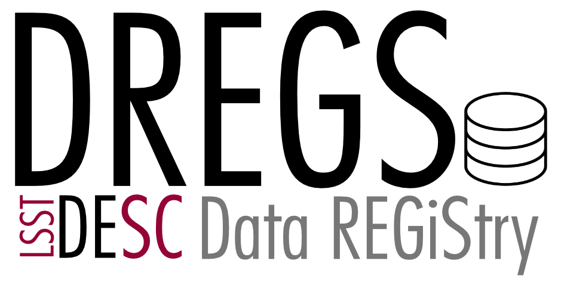

# dataregistry
A facility to store and retrieve datasets. Metadata - some required, some optional - may be used in searches.

### Documentation

Full documentation can be found [here](http://lsstdesc.org/dataregistry).
