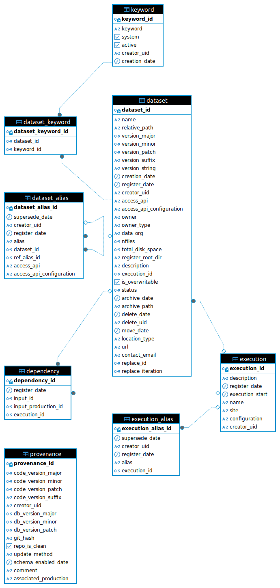

Introduction
============

What is the DESC data registry software?
----------------------------------------

Call it DREGS for short.

**What is is?**

A means of keeping track of datasets: where they are, when they were
produced, what precursor datasets they depend on, etc. 

**Who is it for?**

Anyone who creates a dataset for which provenance and accessibility are
important, e.g.

- it is of general interest within the collaboration
- it is used as input to further analysis steps
- it is referenced in a paper

...and anyone who needs to find and access such a dataset.

The database layout
-------------------

List of tables

dataset
~~~~~~~

.. list-table::
   :widths: 20 50 15 15
   :header-rows: 1

   * - row
     - description
     - type
     - required
   * - ``dataset_id``
     - Unique identifier (automatic)
     - int
     - -
   * - ``name``
     - Dataset name
     - str
     - Yes
   * - ``relative_path``
     - Path relative to <root>/ownership_type 
     - str
     - Yes
   * - ``version_major``
     - Version major (e.g., **1**\ .1.2)
     - int
     - Yes
   * - ``version_minor``
     - Version minor (e.g., 1.\ **1**\ .2)
     - int
     - Yes
   * - ``version_patch``
     - Version patch (e.g., 1.1. **2**)
     - int
     - Yes
   * - ``version_suffix``
     - Optional version suffix
     - str
     - No
   * - ``dataset_creation_date``
     - Dataset creation data (automatic)
     - datetime
     - -
   * - ``is_archived``
     - xx
     - xx
     - xx
   * - ``is_external_link``
     - xx
     - xx
     - xx
   * - ``is_overwritable``
     - xx
     - xx
     - xx
   * - ``is_overwritten``
     - xx
     - xx
     - xx
   * - ``is_valid``
     - xx
     - xx
     - xx
   * - ``register_data``
     - xx
     - xx
     - xx
   * - ``creator_uid``
     - xx
     - xx
     - xx
   * - ``access_API``
     - xx
     - xx
     - xx
   * - ``execution_id``
     - xx
     - xx
     - xx
   * - ``description``
     - xx
     - xx
     - xx
   * - ``owner_type``
     - xx
     - xx
     - xx
   * - ``owner``
     - xx
     - xx
     - xx

dataset_alias
~~~~~~~~~~~~~

.. list-table::
   :widths: 20 50 15 15
   :header-rows: 1

   * - ``dataset_alias_id``
     - xx
     - xx
     - xx
   * - ``alias``
     - xx
     - xx
     - xx
   * - ``dataset_id``
     - xx
     - xx
     - xx
   * - ``supersede_data``
     - xx
     - xx
     - xx
   * - ``register_date``
     - xx
     - xx
     - xx
   * - ``creator_uid``
     - xx
     - xx
     - xx

dependency
~~~~~~~~~~

.. list-table::
   :widths: 20 50 15 15
   :header-rows: 1

   * - ``dependency_id``
     - xx
     - xx
     - xx
   * - ``register_date``
     - xx
     - xx
     - xx
   * - ``input_id``
     - xx
     - xx
     - xx
   * - ``output_id``
     - xx
     - xx
     - xx

execution
~~~~~~~~~

.. list-table::
   :widths: 20 50 15 15
   :header-rows: 1

   * - ``execution_id``
     - xx
     - xx
     - xx
   * - ``description``
     - xx
     - xx
     - xx
   * - ``register_date``
     - xx
     - xx
     - xx
   * - ``execution_start``
     - xx
     - xx
     - xx
   * - ``name``
     - xx
     - xx
     - xx
   * - ``locale``
     - xx
     - xx
     - xx
   * - ``creator_uid``
     - xx
     - xx
     - xx

execution alias
~~~~~~~~~~~~~~~

.. list-table::
   :widths: 20 50 15 15
   :header-rows: 1

   * - ``execution_alias_id``
     - xx
     - xx
     - xx
   * - ``alias``
     - xx
     - xx
     - xx
   * - ``execution_id``
     - xx
     - xx
     - xx
   * - ``supersede_date``
     - xx
     - xx
     - xx
   * - ``register_date``
     - xx
     - xx
     - xx
   * - ``creator_uid``
     - xx
     - xx
     - xx
