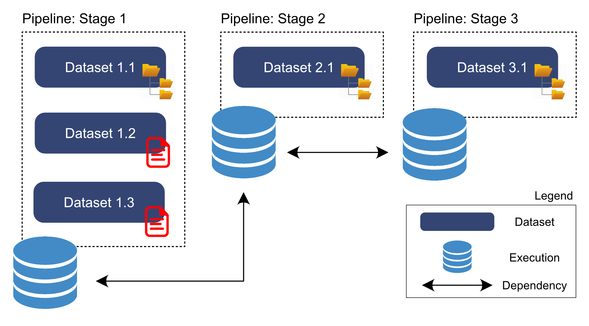

Usage
======

Inputting datasets connected through a pipeline
-----------------------------------------------

Let's go through an example of how to register data into `DREGS` from a
complete end-to-end pipeline. A "pipeline" in this context is any collection of
datasets that are inter-dependent, i.e., the output data from one process feeds
into the next process as its starting point. For example, a pipeline could
start with some raw imagery from a telescope, this raw imagery is then reduced
and fed into a piece of software that outputs a human-friendly value added
catalog. Or, a pipeline could be from a numerical simulation, starting with the
simulation's initial conditions, which then feed into an N-body code, which
then feed into a structure finder and gets reduced to a halo catalog.   

In the DESC data registry nomenclature, each stage of a pipeline is an
"execution", the data product(s) produced during each execution are "datasets",
and executions are linked to one another via "dependencies". 

For this example, we have a pipeline comprising of three stages. In the first
stage three datasets are produced, one dataset is a directory structure, and
the remaining two are individual files. The data output from the first stage
feeds into the second stage as input, which in turn produces its own output (in
this case a directory structure). Finally, the output data from stage two is
fed into the third stage as input and produces its own output dataset directory
structure. Thus our three stages have a simple sequential linking structure;
`Stage1 -> Stage2` and `Stage2 -> Stage3`.

How then would we go about inputting this pipeline into the DESC data registry?
Below is a graphical representation of the entries in `DREGS` we will need to
create, which we go through step-by-step below.

Option 1: Using the ``dataregistry`` Python package
~~~~~~~~~~~~~~~~~~~~~~~~~~~~~~~~~~~~~~~~~~~~~~~~~~~

The first option is to create the database entries using the ``dataregistry``
Python package. 

First we register an `execution` entry, to represent the first stage of our pipeline.

.. code-block:: python

   import os
   import sys
   from dataregistry.registrar import Registrar
   from dataregistry.db_basic import create_db_engine, ownertypeenum, SCHEMA_VERSION

   DREGS_CONFIG = os.getenv("DREGS_CONFIG")

   # Establish connection to database
   engine, dialect = create_db_engine(config_file=DREGS_CONFIG)

   

Option 2: Using the `DREGS` CLI
~~~~~~~~~~~~~~~~~~~~~~~~~~~~~~~

TBA

Querying datasets in a pipeline
~~~~~~~~~~~~~~~~~~~~~~~~~~~~~~~

TBA
